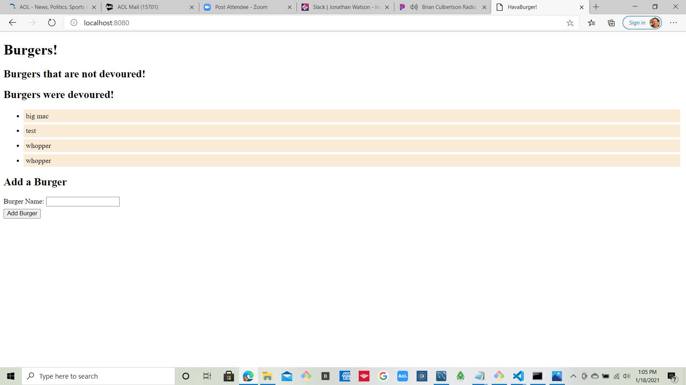

# handlebars-project

## Objective

The objective of this assignment was the introduction of " Handlebars " and the
creation of a project using Handlebars and MYSQL . The user has the ability to create a burger of their choice and that choice is listed under " Burgers that are not devoured! " with a button labeled " Devour! ". Should the user depress the " Devour " button the burger will be transferred to " Burgers were devoured! "

## Software used in this Project

a) HandleBars
b) MYSQL
C) Express
d) Sequelize
e) Schema
f) images

## Screenshots:

## Below is the start page

## Burger being added to the list

## Order Confirmation

## Enhancements:

Additional menu items can be offered with the same functionality .
